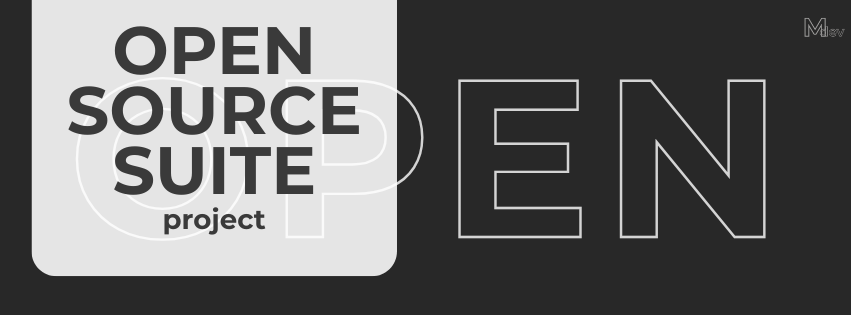

# MatteDev Open Source Suite project (OSSp)

**MatteDev OSSp** è l’anima aperta di **MatteDev Studio**. Consiste in una suite integrata di applicazioni e strumenti digitali i cui codici sorgenti sono resi pubblici, permettendo a chiunque di studiarli, migliorarli e utilizzarli liberamente.

L’obiettivo non è solo offrire software gratuito, ma stabilire un nuovo standard di fiducia e collaborazione tra sviluppatore e utente finale.

---

### 📦 Ecosistema dei Servizi OSSp

| Servizio | Descrizione Rapida | Repository Ufficiale | Licenza |
| :--- | :--- | :--- | :--- |
| **MatteDev Quill** | Editor di testo e produttività d'élite. | [Vai alla Repo](https://github.com/hi-its-matte/mattedev-quill) | MIT |
| **MatteDev AI** | Assistenza intelligente accessibile a tutti. | [Vai alla Repo](https://github.com/hi-its-matte/MatteDev-Ai) | MIT |
| **mdev-platform** | Il launcher e cuore pulsante della suite. | [Vai alla Repo](https://github.com/hi-its-matte/mdev-platform) | MIT |
| **ShortCut** | Strumento per l'ottimizzazione dei flussi quotidiani. | [Vai alla Repo](https://github.com/hi-its-matte/ShortCut) | MIT |
| **mywebsite** | Il portale ufficiale di MatteDev Studio. | [Vai alla Repo](https://github.com/hi-its-matte/mywebsite) | MIT |
| **Event2026** | Gestione e visualizzazione eventi per l'anno 2026. | [Vai alla Repo](https://github.com/hi-its-matte/Event2026) | MIT |
| **boards-website** | Sistema di gestione bacheche e contenuti web. | [Vai alla Repo](https://github.com/hi-its-matte/boards-website) | MIT |

---

### 💡 La Nostra Filosofia: Semplicità Complessa
*   **Accessibilità Universale:** Ogni soluzione è progettata per essere intuitiva e fruibile da tutti.
*   **Design Centrato sull'Umano:** Applichiamo i principi del Material Design per rendere l'interazione naturale.
*   **Performance Democratiche:** Software ottimizzato per ogni configurazione hardware.
*   **Rigore Tecnico:** Architetture solide e sicure dietro ogni interfaccia minimalista.

> "In MatteDev Studio crediamo che la tecnologia più potente sia quella condivisa. OSSp non è solo una collezione di programmi, ma un manifesto: l'innovazione è reale solo quando è accessibile."

---

  <b>Esplora l'intero ecosistema su <a href="https://platform.mattedev.com">platform.mattedev.com</a></b>

